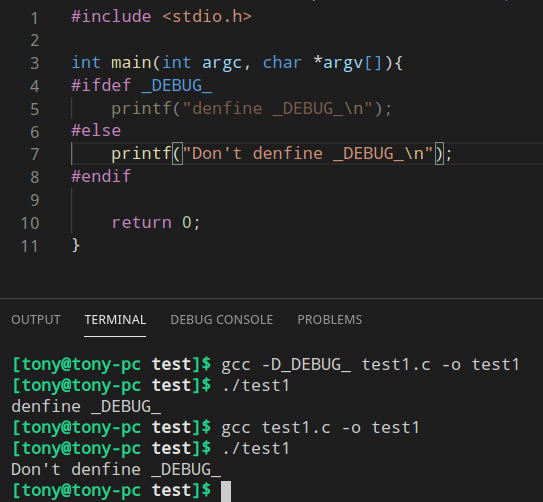

# 达学网校Linux+C语言课程

## 一、Linux操作系统学习材料
[在线视频](https://www.bilibili.com/video/av69981906?p=1)

## 二、Linux C语言学习
[在线视频](https://www.bilibili.com/video/av69981906?p=31)

### %hhd——输出ASCII码
```c
int main(int argc, char *argv[]){
    char c = 97;
    printf("ASCII 97 = %c\n", c);
    printf("ASCII 97 = %hhd\n", c);

    return 0;
}

[tony@tony-pc 10.binary_system]$ ./test 
ASCII 97 = a
ASCII 97 = 97
```
如果
```c
char c = 200;
printf("ASCII 200 = %c\n", c);
printf("ASCII 200 = %hhd\n", c);

得到的 %hhd结果是负数，那么两个数的绝对值就是计算机位数，
ASCII 97 = �
ASCII 97 = -56

56+200=256=2^8,所以计算机是 8 位存储字符类型的
```

### %02d——格式化输出 00
```c
printf("The time is %02d:%02d:%02d \n", hour, min, sec);

The time is 01:00:00
```

### [数组形参](2Linux_C语言学习材料/3.code/38.array_parameter/day38.c)
函数形参不能修改函数外的，但是数组是可以的

### 文件
#### 框架
```c
int main(int argc, char *argv[]){
    FILE *p_file = fopen("/home/tony/Chat_online/Server.java", "w");
    if(!p_file){
        printf("File open fail");
        return 0;
    }
    fclose(p_file);
    p_file = NULL;

    return 0;
} 
```

文件打开模式
```
r   只能读文件，读操作从文件头开始，文件必须事先存在

r+  在前一个模式的基础上增加修改能力

w   只能修改文件内容，修改操作从文件头开始如果文件事先不存在则创建新文件，如果文事先已经存在则删除原有文件中的内容

w+  在前一个模式的基础上增加读能力

a   只能修改文件内容，如果文件事先不存则创建新文件，如果文件事先已经存在则在源文件的原有内容的基础上追加新内容
	
b   可以和前面任何一种模式混合使用，这模式表示以二进制方式对文件进行操作
```

fread/fwrite用来想文件读写数据
```
四个参数
1、数组（fread会吧文件中得到的内容存放到
数组的存储单位内，fwrite会吧数组中存储位置
的内容写入文件）
2、数组中单个存储位置的大小
3、希望使用存储位置的个数
4、要操作的文件
```

### 变量
1、auto用来声明自动变量，所有局部变量都缺省的是自动变量，几乎不需要使用这个关键字

2、static关键字用来声明静态变量  

3、const  常量

4、[volatile关键字](2Linux_C语言学习材料/3.code/45.volatile/day45.c)
volatile关键字用来声明多变变量，这种变量的内容随时可能被改变，而且这种改变的原因不是我们的语句造成的！

volatile关键字告诉编译器i是随时可以发生改变的每次使用他的时候必须从i的地址中读取，因为编译器生成的可执行代码会从i的地址读取数据放在k

而优化的方法就是，由于编译器发现两次从 i 读取数据的代码之间的代码没有对i进行过操作他会自动吧上次读的数据放在k中，而不是从新从i里面读取，这样一来，如果i是一个寄存器变量或者端口数据就容易出错，

volatile关键字有个优点：可以保证对特殊地质的稳定性访问

### [数组如何做到回车停止输入](2Linux_C语言学习材料/3.code/48.use_point/test/test.c)

### 随机数
我们计算机所做的随机数都是伪随机

rand标准函数用来获得随机数
使用rand标准函数需要使用stdlib.h头文件

srand标准函数可以用来设置随机数种子
srand（）
随机种子，吧时间当做随机种子种下即可

time可以用来获取当前时间，得到的时间是一个
整数类型

代表的是1970年1月1日0时0分0秒到我们
现在此时此刻的时间

### void*类型的指针
这种类型的指针只表示了其中记录了一个地址数据但是没告诉我们可以根据他找到什么类型的存储位置

void型指针通常用来接收来源不明的数据地址

void型指针用来做形参

### 地址数据所能参与的四则运算

**只能够+和-，不能乘和除！**加和减也有限制
```
地址 + 整数
地址 - 整数
地址 - 地址
```

以上计算中的整数都是有单位的，单位由地址数据的类型决定

地址数据相减的结果是整数，这个整数也是有单位的，单位由地址数据的类型决定

### [字符串演示](2Linux_C语言学习材料/3.code/56.string_function/day56.c)

### 少使用scanf——最安全的输入：fget
scanf不能输入带' '的字符串,字符串太长了，scanf越界错误

使用 [fget](2Linux_C语言学习材料/3.code/58.gets/day58.c)

### 文件位置指针
文件位置还真用来记录下一次文件操作的开始
位置
这个指针会记录一个整数，这个整数代表这个
位置到文件头的距离
```
ftell标准函数可以得到位置指针的数值
rewind标准函数可以设置位置指针到文件开头
```
fseek标准函数可以吧文件位置指针移动到文件中的任何位置
三个参数
- 1、要操作的文件
- 2、要移动的位置
- 3、下面这三个参数之一
    > SEEK_SET   0文件头作为基准位置
    > SEEK_CUR   1当前位置作为基准位置 
    > SEEK_END   2文件尾作为基准位置 

### 宏
使用fget输入[计算圆周率](2Linux_C语言学习材料/3.code/65.macro_compute/test/test.c)

#### 宏操作符——[#和##](2Linux_C语言学习材料/3.code/66.macro_operator/day66.c)

#操作符：可以吧宏的一个参数转换成字符串字面值

##操作符：可以吧一个代表标识符的参数和其他内容合并成一个新的标识符


### 条件编译演示
```
gcc -D
使用gcc编译源文件的时候，加上选项-D，可以定义一个宏
```



## 三、Unix,linux核心编程
[在线视频](https://www.bilibili.com/video/av69981906?p=92)
